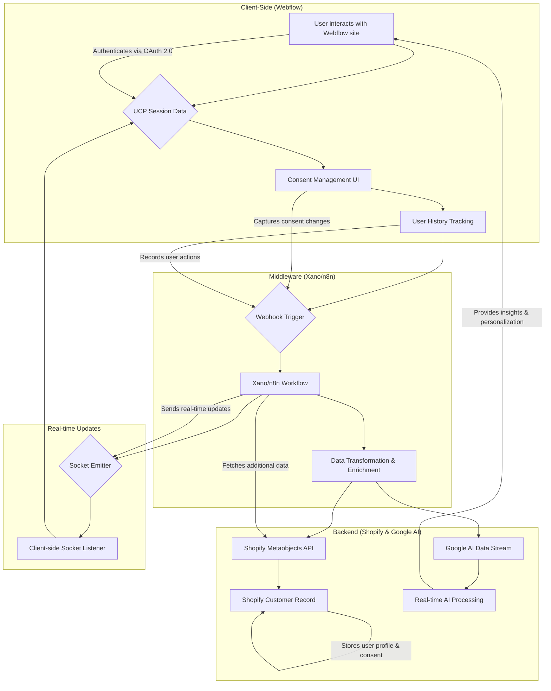

# Technical Guideline: Webflow to Shopify & Google AI Data Integration

**Document Version:** 1.0  
**Date:** January 14, 2026  
**Author:** Manus AI

## 1. Introduction

This document provides a comprehensive technical guideline for integrating a Webflow front-end with a sophisticated backend ecosystem, including Shopify and Google AI. The primary goal is to establish a real-time, event-driven data pipeline that captures user interactions, manages consent, and streams data for AI-powered personalization and analytics.

This architecture leverages a headless approach, with Webflow serving as the presentation layer, Xano/n8n as the middleware for data processing and orchestration, and Shopify and Google AI as the backend for data storage and intelligence. This creates a powerful and flexible system for building next-generation e-commerce experiences.

### 1.1. Key Technologies

*   **Webflow:** Front-end presentation layer and user interface.
*   **UCP (Universal Commerce Protocol):** For session management and user history.
*   **Xano/n8n:** Middleware for webhook processing, data transformation, and workflow automation.
*   **Shopify:** Backend for customer data management, utilizing Metaobjects for custom data storage.
*   **Google AI Platform:** For real-time data streaming and AI-powered analytics.
*   **WebSockets:** For real-time, bidirectional communication between the client and server.

## 2. Data Flow Architecture

The following diagram illustrates the complete data flow from the client-side in Webflow to the backend services.

### 2.1. Architecture Overview

1.  **Client-Side (Webflow):** The user interacts with the Webflow site. All user actions, session data, and consent changes are captured on the client-side.
2.  **Webhook Trigger:** When a significant event occurs (e.g., consent change, page view), a webhook is sent to the middleware layer (Xano/n8n).
3.  **Middleware (Xano/n8n):** The middleware processes the incoming webhook data, transforms and enriches it, and then orchestrates the data flow to the backend services.
4.  **Backend (Shopify & Google AI):** The processed data is sent to Shopify to be stored in customer records using Metaobjects and streamed to Google AI Platform for real-time analysis.
5.  **Real-time Updates:** The middleware also emits events via WebSockets to the client-side, allowing for real-time updates to the user interface based on backend processing.

## 3. Implementation Details

### 3.1. Webflow & UCP Integration

**Objective:** Capture user session data, history, and consent on the Webflow front-end.

**1. UCP Session Management:**

*   Implement a client-side JavaScript module to manage the UCP session. This module should handle session creation, data storage (in `localStorage` or `sessionStorage`), and retrieval.
*   The session data should include a unique session ID, user authentication status (if applicable), and any other relevant session-specific information.

**2. User History Tracking:**

*   Create a JavaScript event listener that captures all significant user actions, such as page views, button clicks, and form submissions.
*   Each event should be stored in an array as part of the UCP session data. The event object should include a timestamp, event type, and any relevant metadata.

**3. Consent Management:**

*   Build a consent management UI in Webflow that allows users to grant or revoke consent for different data processing purposes.
*   The user's consent status should be stored in the UCP session data and also in a persistent manner (e.g., a cookie or `localStorage`).
*   When a user's consent status changes, a webhook should be triggered to notify the middleware.

**4. Webhook Trigger:**

*   Write a JavaScript function that sends a POST request to the Xano/n8n webhook endpoint whenever a tracked event occurs.
*   The webhook payload should include the entire UCP session object, including the user history and consent status.

### 3.2. Xano/n8n Middleware

**Objective:** Process incoming webhooks, transform data, and orchestrate the data flow to Shopify and Google AI.

**1. Webhook Endpoint:**

*   Create a new webhook endpoint in Xano or n8n that is configured to receive the POST requests from the Webflow front-end.

**2. Data Transformation:**

*   Create a workflow that is triggered by the webhook.
*   The first step in the workflow should be to parse the incoming JSON payload.
*   Next, transform the data into the format required by the Shopify and Google AI APIs. This may involve renaming fields, restructuring the data, or enriching it with additional information (e.g., IP address geolocation).

**3. Shopify Integration:**

*   Use the Shopify API connector in Xano or the Shopify node in n8n to interact with the Shopify Admin API.
*   **Find or Create Customer:** Use the user's email address to find an existing customer in Shopify. If no customer is found, create a new one.
*   **Update Metaobjects:** Use the Shopify Metaobjects API to store the user's consent status and any other custom data. Create a custom Metaobject definition in Shopify to store this data.

**4. Google AI Data Stream:**

*   Use the Google AI Platform API connector to stream the processed data to a Google AI data stream.
*   The data should be sent in a structured format (e.g., JSON) that can be easily parsed by Google AI for real-time analysis.

**5. WebSocket Emitter:**

*   Use the WebSocket module in Xano or n8n to emit an event to the client-side.
*   The event payload should include any data that is needed to update the UI in real-time, such as a confirmation that the user's consent has been updated.

### 3.3. Shopify Backend

**Objective:** Store customer data, including consent and user history, in Shopify.

**1. Metaobject Definition:**

*   In your Shopify admin, navigate to **Settings > Custom data > Metaobjects**.
*   Create a new Metaobject definition called "UCP User Profile".
*   Add the following fields to the Metaobject:
    *   `consent_status`: A JSON field to store the user's consent preferences.
    *   `user_history`: A JSON field to store the user's browsing history.
    *   `last_seen`: A datetime field to store the user's last active timestamp.

**2. Customer Record:**

*   When a new customer is created in Shopify, associate the "UCP User Profile" Metaobject with the customer record.
*   This will allow you to store and retrieve the user's UCP data directly from the Shopify customer record.

### 3.4. Google AI Data Stream

**Objective:** Stream user interaction data to Google AI Platform for real-time analysis.

**1. Create a Data Stream:**

*   In the Google Cloud Console, navigate to the AI Platform and create a new data stream.
*   Configure the data stream to accept JSON data.

**2. Real-time Analytics:**

*   Use Google AI Platform's tools to build real-time analytics dashboards and reports based on the incoming data.
*   You can also use the data to train machine learning models for personalization and recommendations.

## 4. Security Considerations

### 4.1. Data Encryption

*   All data in transit between the client, middleware, and backend services MUST be encrypted using TLS.
*   Sensitive user data stored in Shopify Metaobjects should be encrypted at rest.

### 4.2. Authentication

*   All API requests to the middleware and backend services MUST be authenticated using API keys or OAuth 2.0 tokens.
*   Webhooks from Webflow should be secured using a secret key to verify the authenticity of the request.

### 4.3. Consent Management

*   The user's consent preferences MUST be respected at all times.
*   Data should only be processed for the purposes for which the user has given their explicit consent.

## 5. References

1.  [Webflow API Documentation](https://developers.webflow.com/)
2.  [Xano Documentation](https://docs.xano.com/)
3.  [n8n Documentation](https://docs.n8n.io/)
4.  [Shopify Metaobjects API](https://shopify.dev/docs/api/admin-graphql/2023-10/objects/Metaobject)
5.  [Google AI Platform Documentation](https://cloud.google.com/ai-platform/docs)
